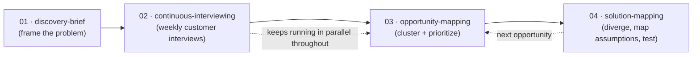

# Claude Skills — UX Discovery Toolkit

Custom [Claude Skills](https://www.anthropic.com/news/skills) that turn a UX discovery
methodology into reusable, repeatable workflows — Teresa Torres–style continuous discovery
plus Object-Oriented UX — instead of a process that only lives in one designer's head.

Each skill is a self-contained `SKILL.md`: a YAML-fronted markdown file that tells Claude
*when* to trigger, *how* to run the workflow, and *what* to hand back. Point Claude at a
fuzzy problem or a stack of interview notes and get a structured, evidence-tagged artifact
back — not a one-off prompt result.

## Contents

- [Why this exists](#why-this-exists)
- [The discovery flow](#the-discovery-flow)
- [Skills](#skills)
- [Repo structure](#repo-structure)
- [Using these skills](#using-these-skills)
- [Anatomy of a skill](#anatomy-of-a-skill)
- [Status](#status)
- [License](#license)

## Why this exists

Running discovery well — framing the right problem, interviewing customers on a steady
cadence, mapping opportunities instead of jumping to solutions, and pressure-testing
assumptions before committing design time — is a skill most senior designers carry as tacit
knowledge. It works, but it isn't repeatable by anyone except the person who internalized it.

This repo encodes that process as software: each phase of the methodology becomes a Claude
Skill with an explicit process, output format, and set of failure modes to guard against.
The goal is a discovery practice that's systemized and inspectable, not just documented in a
doc nobody re-reads.

## The discovery flow

Four of the five skills form one continuous cycle, run in order the first time through a
project and then looped for each new opportunity:



`ooux-designer` sits outside this cycle — it's a standalone skill for modeling any feature,
data structure, or UI once you're in the design/build phase, whether or not it came out of
the discovery flow above.

## Skills

| # | Skill | What it does | Use it when |
|---|-------|---------------|-------------|
| 01 | [`discovery-brief`](01-discovery-brief/SKILL.md) | Builds a problem-framing brief: a RACI chart, a pressure-tested problem statement, and a product outcome (not a business metric, not a feature) with supporting hypotheses. | Kicking off a new discovery project, before any interviews or opportunity work. |
| 02 | [`continuous-interviewing`](02-continuous-interviewing/SKILL.md) | Sets up a weekly customer-interview habit: recruiting loop, story-based interview guide, per-interview snapshots (verbatim quotes + tagged insights), and a running cross-interview timeline. | Right after an outcome is defined. Runs continuously — it never fully "ends," even while later steps are underway. |
| 03 | [`opportunity-mapping`](03-opportunity-mapping/SKILL.md) | Turns interview snapshots into an opportunity tree (needs/pains/desires clustered under the outcome), then scores and prioritizes which opportunity to pursue first. | Once a handful of interviews (~5-8) are in and it's time to decide what to work on. |
| 04 | [`solution-mapping`](04-solution-mapping/SKILL.md) | Diverges on 5-8+ solution ideas for the chosen opportunity, maps the riskiest assumptions across desirability/viability/feasibility/usability, and designs the smallest test for the riskiest one. | Once one opportunity is selected and it's time to explore — and de-risk — solutions. |
| — | [`ooux-designer`](ooux-designer/SKILL.md) | Applies Object-Oriented UX via the ORCA framework (Objects, Relationships, Calls-to-action, Attributes) to model a feature, data structure, or UI hierarchy. | Designing or structuring any feature, schema, or component set — independent of the flow above. |

Every skill defaults to **solo-driver mode**: guidance assumes a single designer is running
discovery without a PM/engineer trio in the room, and calls out explicitly which judgment
calls (feasibility, viability) deserve a second opinion before being treated as settled.

## Repo structure

```
skills/
├── 01-discovery-brief/
│   └── SKILL.md
├── 02-continuous-interviewing/
│   └── SKILL.md
├── 03-opportunity-mapping/
│   └── SKILL.md
├── 04-solution-mapping/
│   └── SKILL.md
└── ooux-designer/
    └── SKILL.md
```

The `NN-` prefixes on the discovery-flow skills reflect run order; `ooux-designer` is
unprefixed since it's used independently.

## Using these skills

These are standard [Claude Skills](https://www.anthropic.com/news/skills) — each folder's
`SKILL.md` is auto-discovered by its YAML frontmatter (`name` + `description`), no build
step required.

1. Clone this repo (or download the skill folder(s) you want).
2. Copy a skill folder into a Claude Skills directory:
   - **Personal, available everywhere:** `~/.claude/skills/`
   - **Project-scoped:** `<your-project>/.claude/skills/`
3. Claude will trigger the skill automatically when a request matches its `description` —
   e.g. saying "help me kick off discovery for this project" surfaces `discovery-brief`.

You can also install a single skill rather than the whole repo — each `SKILL.md` is fully
self-contained.

## Anatomy of a skill

Every `SKILL.md` follows the same shape:

```markdown
---
name: skill-name
description: What it does and — critically — the exact phrases/situations that should
             trigger it. This is what Claude matches against, so it's written to be
             specific rather than a generic summary.
---

# Skill Title

Process, output format, and common failure modes to flag while running it.
```

## Status

Actively used and evolving alongside my own discovery practice — expect skills to get
trimmed, merged, or renamed as the methodology sharpens (see commit history). Built and
maintained by [Cindy Rhodes](https://github.com/iowarhodes).

## License

No license file yet, so default copyright applies (all rights reserved). If you'd like to
reuse or adapt these skills, open an issue or reach out first.
